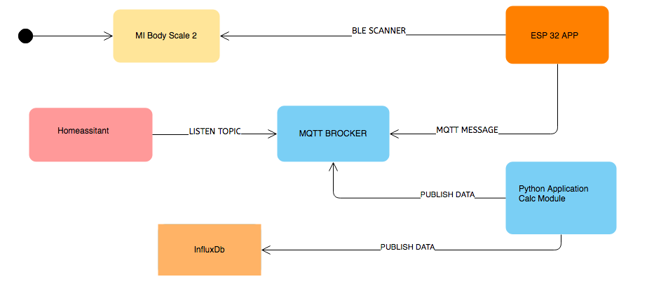

# Connector for Xiaomi Mi Scale - Develop Version

## Body Composition Scale 2 (XMTZC05HM) Data to MQTT / Influxdb
Code to read weight measurements from Xiaomi Body Scales.




## Prerequisites

An MQTT broker is needed as the counterpart for this daemon. Even though an MQTT-less mode is provided, it is not recommended for normal smart home automation integration. MQTT is huge help in connecting different parts of your smart home and setting up of a broker is quick and easy.

- Body Composition Scale 2 (XMTZC05HM)
- ESP32 (BLE SCANNER)
- Raspberry or Linux computer
- Python 3 (min)
- MQTT broker
- Libs see requirements.txt
- Optional influxdb


## Installation

On a modern Linux system just a few steps are needed to get the daemon working. The following example shows the installation under Debian/Raspbian below the `/opt` directory:


```bash
$ su -
$ cd /opt/
$ git clone https://github.com/zibous/ha-miscale2.git
$ cd /opt/ha-miscale2
$ sudo pip3 install -r requirements.txt

```

To match personal needs, all operation details can be configured using the file **conf.py** The file needs to be created first:

```bash
$ cd /opt/ha-miscale2
$ cp conf.py.dist conf.py

# edit configuration settings
$ nano conf.py

$ chmod +x app.py
$ chmod +x mqttservice.py
$ chmod +x service.sh
$ chmod +x service_mqtt.sh

## tests
$ python3 app.py
$ ./app.py
$ ./app.py && tail -f /var/log/syslog | grep MIBCS2

$ python3 mqttservice.py
$ ./mqttservice.py && tail -f /var/log/syslog | grep MIBCS2

```


## Application for Raspberry / Linux computer

Read [Xiaomi Mi Body Composition Scale](https://www.mi.com/global/mi-body-composition-scale) data from a Raspberry Pi in Python 3.

### Execution
`python3 app.py`

## MQTT service for ESP32 Devices
A simple Python script which provides a MQTT gateway for ESP Devices, easily extensible via custom workers. Application for ESP Devices see:

https://github.com/1technophile/OpenMQTTGateway

### Execution
`python3 mqttservice.py`

### Example for data payload from OpenMQTTGateway
```json
MQTT TOPIC: tele/BTtoMQTT/5CCAD34CEE74

PAYLOAD : 
   {  "id":"5C:CA:D3:4C:EE:74",
      "name":"MIBFS",
      "manufacturerdata":"57015ccad34cee74",
      "rssi":-68,
      "distance":2.799256,
      "model":"XMTZC05HM",
      "measured":70.5,
      "impedance":485,
      "unit":"kg",
      "user":"7",
      "calcweight":141,
      "scantime":"2020-09-26 16:26:15"
   }
```

### Example for data payload from ESP32 simple application
```json
MQTT TOPIC: tele/bodyscale/data

PAYLOAD :
   { "measured": 71.00, 
     "calcweight": 142.00, 
     "impedance": 489, 
     "unit":"kg", 
     "user":"7", 
     "id":"5c:ca:d3:4c:ee:74", 
     "version":"1.0.4", 
     "timestamp":"2020-09-26 12:53:53", 
     "lastscan":"2020-09-25 16:23:10", 
     "scantime":"2020-09-26 13:37:44"
   }
```


## Configuration

You most probably want to execute the program **continuously in the background**. This can be done either by using the internal daemon or cron.

Systemd service for  - on systemd powered systems the **recommended** option

### Application Service:
   ```bash
   $ sudo cp /opt/ha-miscale2/service_app.template /etc/systemd/system/ha-miscale.service
   
   $ sudo systemctl daemon-reload
   $ sudo systemctl start ha-miscale.service
   $ sudo systemctl stop ha-miscale.service
   $ sudo systemctl status ha-miscale.service
   
   $ sudo systemctl enable ha-miscale.service
   ```

### MQTT Service:
   ```bash
   $ sudo cp /opt/ha-miscale2/service_mqtt.template /etc/systemd/system/ha-miscale-mqtt.service
   
   $ sudo systemctl daemon-reload
   $ sudo systemctl start ha-miscale-mqtt.service
   $ sudo systemctl status ha-miscale-mqtt.service
   
   $ sudo systemctl enable ha-miscale-mqtt.service
   ```

## MQTT Data for Homeassistant / Applications

The calculation results are saved once as a history in the data folder, published as an MQTT payload and optionally saved in the defined InfluxDB.

**Sample MQTT Payload**

```json
{
   "measured":70.65,
   "calcweight":70.65,
   "unit":"kg",
   "impedance":485,
   "timestamp":"2020-09-18T06:34:29Z",
   "scantime":"2020-09-18 08:34:29",
   "user":"Peter",
   "sex":"male",
   "athletic":true,
   "age":64.8,
   "metabolic_age":40.39,
   "bmi":23.07,
   "bodytype":"balanced",
   "weight":70.65,
   "idealweight":66.5,
   "lbm":55.76,
   "fat":13.14,
   "fattype":"to_gain",
   "idealfat":1.98,
   "visceral":7.39,
   "water":55.72,
   "bone":3.64,
   "muscle":52.17,
   "protein":20.47,
   "bmr":1222.9,
   "targetweight":68.0,
   "icon":"mdi:scale-bathroom",
   "attribution":"Data provided by Peter Siebler"
}
```
<br>
<hr>

# Acknowledgements:
+ Thanks @lolouk44 to https://github.com/lolouk44/xiaomi_mi_scale<br>
+ Formulas to calculate the various values/measures, I've got them from https://github.com/wiecosystem/Bluetooth


# Informations
- https://inbodyusa.com/general/technology/<br>
- https://github.com/limhenry/web-bluetooth-mi-scale<br>
- https://www.medeia.com/dtr_bioscan_bia.htm<br>
- https://www.jstor.org/stable/41463874<br>
- https://www.wikihow.fitness/Determine-Lean-Body-Mass<br>
- https://www.omnicalculator.com/health/body-fat#how-to-calculate-body-fat<br>
- https://calculator-online.net/ideal-weight-calculator/<br>
- https://en.wikipedia.org/wiki/Body_mass_index<br>
- https://www.calculator.net/bmi-calculator.html<br>
- https://www.calculator.net/calorie-calculator.html<br>
- https://www.omnicalculator.com/health/bmr-katch-mcardle#what-is-the-katch-mcardle-calculator<br>
- https://www.omnicalculator.com/health/maintenance-calorie<br>
- https://en.wikipedia.org/wiki/Body_water<br>
- https://de.wikipedia.org/wiki/Ponderal-Index<br>
- https://en.wikipedia.org/wiki/Body_fat_percentage<br>
- https://en.wikipedia.org/wiki/Lean_body_mass<br>
- http://elsenaju.de/AMI-Rechner.html<br>
- http://elsenaju.de/Kalorien-Bedarf-Rechner.html<br>
- https://www.calculator.net/lean-body-mass-calculator.html<br>
- http://www.dev.egofit.de/biadata-org/<br>
- https://github.com/zewelor/bt-mqtt-gateway<br>
- https://www.mi.com/global/mi-body-composition-scale<br>
- https://dev.to/henrylim96/reading-xiaomi-mi-scale-data-with-web-bluetooth-scanning-api-1mb9<br>
- https://github.com/Wingjam/ReverseMiScale/blob/master/miScale.py<br>
- https://tanita.de/hilfe-und-anleitungen/richtige-interpretation-ihrer-messwerte/<br>
- https://github.com/oliexdev/openScale<br>
- https://support.withings.com/hc/en-us/articles/218500778-Body-What-are-the-normal-ranges-for-body-composition-<br>
- https://googlechrome.github.io/samples/web-bluetooth/scan.html<br>
- https://github.com/IanHarvey/bluepy/blob/master/docs/scanner.rst<br>
- https://passionhome.sg/xiaomi-mi-body-composition-scale-v2-tips-and-instructions/ <br>
- https://github.com/rando-calrissian/esp32_xiaomi_mi_2_hass<br>
- https://github.com/limhenry/web-bluetooth-mi-scale<br>

# Omron, Medisana, Xiaomi
- https://www.amazon.de/Omron-HBF-511B-E-Ganzkörperanalyse-Waage-BF511-blau/dp/B0033AGBW0<br>
- https://www.amazon.de/Medisana-TargetScale-3-0-Waage/dp/B01MZ1VBWZ/<br>
- https://www.amazon.de/Xiaomi-Smart-Bluetooth-Monitor-Display/dp/B07WNM9B57/<br>
